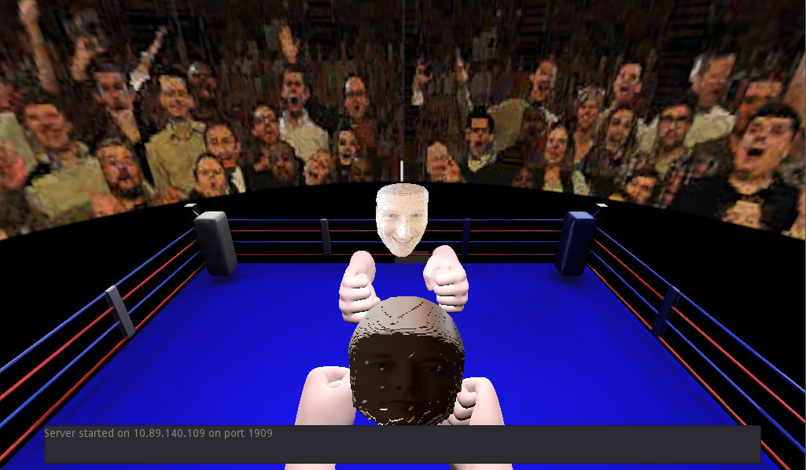
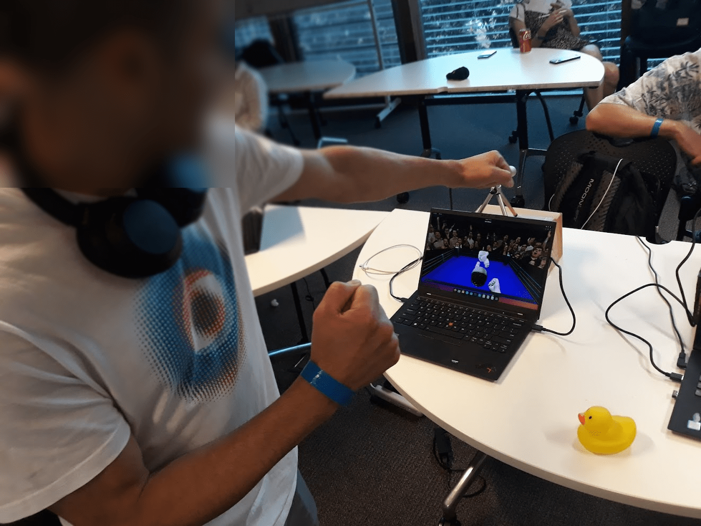

## Zuck it, Musk!
Welcome to "Zuck it, Musk!" - an immersive boxing simulation where you engage with tech giants, Elon Musk and Mark Zuckerberg, in a 3D virtual arena. With advanced depth tracking, this game transforms your real-world punches and dodges directly into the virtual space, allowing you to land blows on Musk or Zuck and artfully avoid their counterattacks by simply moving around. 

  
   

### Introduction
Created during a fierce 44-hour coding sprint for the UQ Computing Society Hackathon, this game offers a glimpse into what might have been. While Elon Musk and Mark Zuckerberg once entertained the idea of an IRL (in real life) fight, it never came to fruition. "Zuck it, Musk!" is our tribute to that unrealized event.

### Features
- Real-Time Motion Capture: Track your hand and head movements in real-time using the Intel RealSense - camera.
- Multiplayer Action: Go head-to-head against a friend in a local match.
- Two Modes: Use an Intel RealSense camera for depth tracking or a standard webcam which looks for open closed hand gestures.
- Stunning Graphics and Effects: Created in the powerful Godot game engine.

### Requirements
- Intel RealSense SDK 2: You'll need the Intel RealSense SDK 2 specific to your operating system (Linux or Windows). This is essential for capturing depth information.
- Python 3.11.4 : Please refer to requirements.txt within the python directory for necessary Python libraries.
- Godot Game Engine: For running the actual game

### Setup & Installation
1) Clone the Repository: git clone <repository-link>
2) Install Intel RealSense SDK 2: Download and install the SDK specific to your OS.
3) Install Python Dependencies: Navigate to the python folder and run pip install -r requirements.txt.
4) Run the Python script: Either run the realsense.py script or the webcam.py script depending on which you want to use. Note: webcam script currently not implemented into the game
4) Run the Game: Navigate to the kybo folder and open the main Godot project to run the game.
5) Connect to a Local Server: If you want to play with friends over a local server by updating the hosts ip in the Global file.

### Special Mentions
Thanks to Ahmad, Edward and Kaz for coming together and building something silly. Thanks to UQCS for hosting the event and the sponsors for putting food on the table.